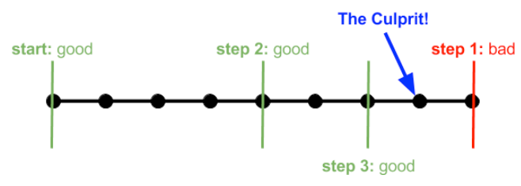
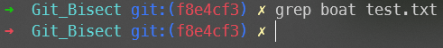
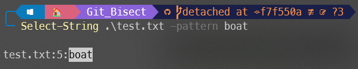
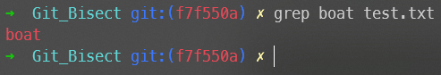
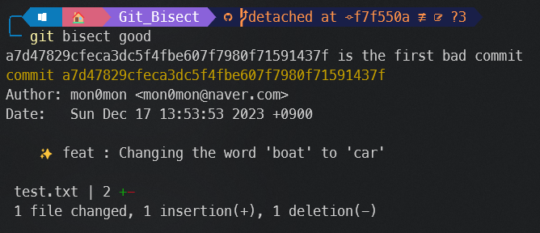
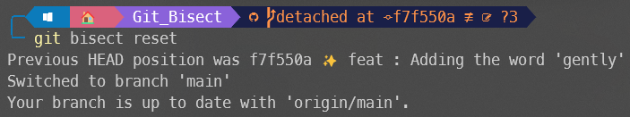

#  Git Bisect 튜토리얼

- [Git Bisect 튜토리얼](#git-bisect-튜토리얼)
  - [명령어 설명](#명령어-설명)
  - [상황 설명](#상황-설명)
  - [튜토리얼 진행](#튜토리얼-진행)
    - [1. 리포지토리 클론](#1-리포지토리-클론)
    - [2. test.txt의 내용 확인](#2-testtxt의-내용-확인)
    - [3. `bisect` 시작](#3-bisect-시작)
    - [4. 현재 커밋을 `bad`로 지정](#4-현재-커밋을-bad로-지정)
    - [5. 버그가 발생하기 전의 커밋을 `good`으로 지정](#5-버그가-발생하기-전의-커밋을-good으로-지정)
    - [6. `bisect`로 현재 확인 중인 커밋에서 버그가 발생했는 지 확인](#6-bisect로-현재-확인-중인-커밋에서-버그가-발생했는-지-확인)
    - [7. 버그가 발생하지 않은 커밋일 경우 `git bisect good`으로 지정](#7-버그가-발생하지-않은-커밋일-경우-git-bisect-good으로-지정)
    - [8. `git bisect reset`으로 `bisect` 종료](#8-git-bisect-reset으로-bisect-종료)
  - [참고](#참고)

## 명령어 설명

```
git 리포지토리에서 발생한 문제점을 빠르게 찾기 위한 명령어
```

이진 탐색을 통해, 문제의 커밋을 탐색하기에 효율적인 방법으로 찾을 수 있음
- > ex) 1024개의 커밋이 있을 때, 최대 10번이면 문제의 커밋을 찾을 수 있음




## 상황 설명

> 🐛 리포지토리에 있는 test.txt 파일에 boat 대신, car가 존재한 버그가 발생

## 튜토리얼 진행

### 1. 리포지토리 클론

```bash
git clone https://github.com/mon0mon/Git_Bisect_Tutorial.git
```

### 2. test.txt의 내용 확인

```bash
### HEAD 기준
row
row
row
your
car
gently
down
the
stream
```

### 3. `bisect` 시작

```
git bisect start
```


### 4. 현재 커밋을 `bad`로 지정

```
git bisect bad HEAD
```


### 5. 버그가 발생하기 전의 커밋을 `good`으로 지정

```
git bisect good 34ba8a04dd66
```

### 6. `bisect`로 현재 확인 중인 커밋에서 버그가 발생했는 지 확인

```powershell
## Powershell
Select-String .\test.txt -pattern boat
```

```bash
## Bash
grep boat test.txt
```




> 버그가 여전히 존재하므로, `git bisect bad` 명령어로 다음 커밋까지 진행

### 7. 버그가 발생하지 않은 커밋일 경우 `git bisect good`으로 지정





### 8. `git bisect reset`으로 `bisect` 종료



## 참고

1. [metaltoad](https://www.metaltoad.com/blog/beginners-guide-git-bisect-process-elimination)
2. [강남언니](https://blog.gangnamunni.com/post/understanding_git_bisect/)
3. [sumologickorea](https://www.sumologickorea.com/blog/who-broke-my-test-a-git-bisect-tutorial/)
